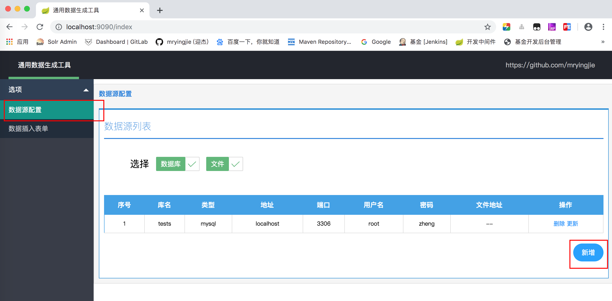
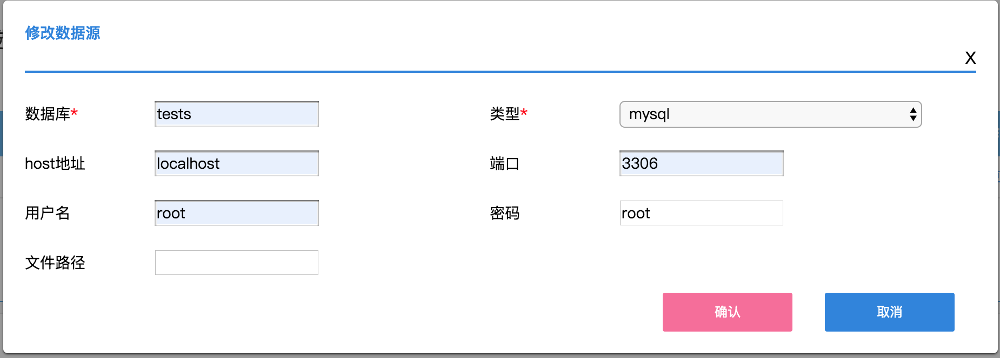
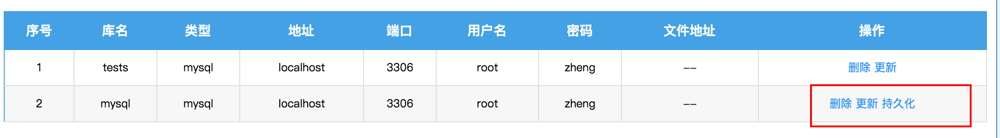
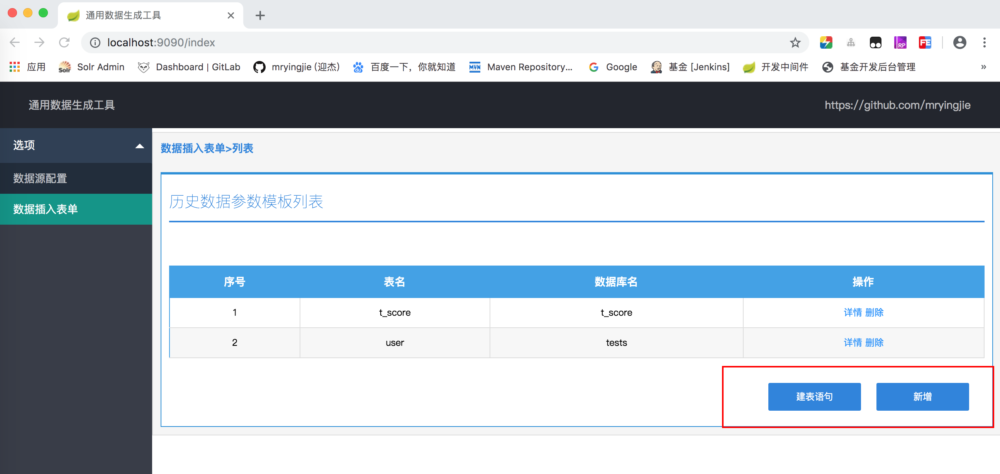
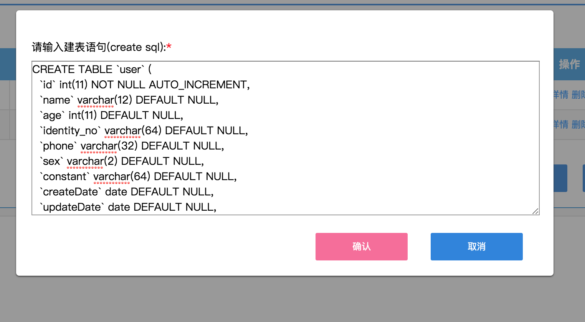

# common-insert

[[License]](./LICENSE)

一个可以按规则快速批量生成测试数据并导入数据源的工具  

支持插入的数据源  
文件：

- [x] csv文件
- [x] xls文件
- [x] xlsx文件

非关系型数据库：

- [x] elasticsearch
- [x] mongoDB

关系型数据库
- [x] mysql  

## 快速开始  
整个jar包是个springboot的web项目，启动后会在本地运行一个tomcat实例,端口默认为9090，启动后浏览器中访问http://localhost:9090/index     
1、确保本地有java8的运行时环境，然后可以直接将项目clone到本地，idea中启动。  
2、你可以下载编译好的zip包到本地，unzip解压 ，无论是window还是linux或mac os 都可以使用java -jar命令启动。注意解压后会有一个jar包和data文件夹，data文件夹保存的是数据，不能删除！如果是刚下载的zip包数据为空。后续的数据持久化都会保存到data文件夹下的文件中。

## 第一种访问方式 使用浏览器访问web页面 链接：http://localhost:9090/index
### 第一步 配置数据源


点击左上角数据源配置，然后点表格右下角新增，按照弹出框的提示配置数据源信息。确定保存。 此时的保存只会保存在缓存中，如果需要持久化保存请点击表格中操作一列的持久化。   

除了mysql数据库之外别的数据源在确定保存时不会检测连接是否可用，而是在插入数据时才会检测连接。
### 第二步 配置字段生成规则
点击第一张图左上角的数据插入表单选项。右下角有一个建表语句按钮和新增按钮。

点击建表语句按钮 将你的建表语句粘贴进去后点确定会跳转到插入表单并将所有字段以及类型罗列。默认都罗列在常量字段表下，可以选择编辑将它移动到别的表格下。


整个页面分为1、基础信息填写数据源和表名  2、常量字段  3、随机字段  4、自增字段，按照页面提示进行填写即可。 最下边有保存  保存并插入两个按钮。  保存按钮只会保存本次的参数列表不会校验参数是否合法。  保存并插入按钮会弹出插入多少条数据的弹出框。填写后确定就会校验参数合法性并生成对应的数据到数据源。


## 第二种访问方式 Postman直接访问插入数据接口http://localhost:9090/insert
如图：  
请求头:


请求体:  


### 请求示例
参数:  
首先贴出一个完整的请求参数再逐一进行解释。  
```json
{
    "num": 100,
    "tableName":"user",
    "database":"tests",
    "userName": "root",
    "password": "root",
    "host": "localhost",
    "port": 3306,
    "constant":{
             "constant":"String|星宿老仙",
             "sex":"String|男,女"
    },
    "increase":{
             "name":"String|0|-1|张三|-1",
             "id":"String|100|-1|-1|-1",
             "phone":"String|0|4|188188|-1",
             "createDateTime":"DateTime|2019-10-21 21:00:00|-1|-1|-1"
    },
    "random":{
             "age":"Integer|-1|100|50|false|-1|-1|false|1|0",
             "identity_no":"String|12|-1|-1|true|-1|-1|true|0|0",
             "createDate":"Date|-1|-1|-1|false|-1|-1|true|2|-1",
             "updateDate":"Date|-1|2019-09-30|2019-09-01|false|-1|-1|false|2|-1",
             "updateDateTime":"DateTime|-1|2019-09-30 00:00:00|2019-09-01 00:00:00|false|-1|-1|false|0|-1",
             "amount":"Decimal|-1|100|0|false|-1|-1|false|1|2"
    }
}
```
### 参数说明：  
num : 插入的条数，比如需要插入1000条数据这里就填1000  
userName : 如果数据源用户访问控制 ，这里填写用户名，如果不需要不用填  
password : 同上这里填写密码，如果不需要不用填  
host : 数据库的地址，如果是文件类型的数据源则不用填  
port : 数据库的端口，如果是文件类型的数据源则不用填，mysql默认是3306 mongo默认是27017 es默认是9200  
database : 数据库名，es中可以不用填  
tableName : 表名，mongo中称为collection，es中称为index  
type : 数据源的类型，目前支持 mysql、es、mongo、excel(csv,xls,xlsx)  
filePath : 如果使用的是excel的数据源,请填写文件所在路径，需要定义好表头数据  
increase : 需要自增的字段,本质是个Map或叫字典也行，以下类同。key是要插入的字段名，value是规则。规则: 类型|从几开始|位数|前缀|后缀  
random : 需要随机生成的字段，规则: 类型|长度|最大值|最小值|是否固定位数|前缀|后缀|是否唯一|字符策略(0:任意 1:纯数字 2:纯字母 3:纯汉字 4:数字+字母 5:数字+汉字 6:字母+汉字)|保留几位小数  
constant : 常量字段 规则：类型|值1,值2... 每条数据都会从值1或值2中随机选择一个

## 规则特殊说明
如无特殊说明，规则的每一位都要填不允许为空，只要是用是否开头描述的规则请填true或false。  
1、自增字段(类型|从几开始|位数|前缀|后缀) : 位数如果没有要求则填-1 否则请填写大于0的整数。程序会根据位数选择左补0或，删除多出来的位数，注意这个位数指不包含前后缀的位数。前缀后缀有就填，没有请填-1  
2、随机字段(类型|长度|最大值|最小值|是否固定位数|前缀|后缀|是否唯一|字符策略(0:任意 1:纯数字 2:纯字母 3:纯汉字 4:数字+字母 5:数字+汉字 6:字母+汉字)|保留几位小数) : 如果选择固定位数则长度必填，会根据长度左补0或截取，否则长度只是限制了最长的长度。最大值最小值以及前后缀有就填没有请填-1。是否唯一决定了随机出来的值是不是唯一的，如果是false则可能重复。如果是Double或Decimal类型的数据需要填写保留几位小数,默认的最大值是10，最小值是0。  
3、常量字段(类型|值1,值2...) : 其实就是枚举几种值，随机选一个  
4、如果是DateTime类型的数据，自增默认每次自增1秒 ，Date类型默认自增1天，暂时不能调整这个值 
5、如果自增字段没有填写从几开始，Date和DateTime类型默认从当前时间开始  
6、如果随机字段没有填写最大值最小值，Date和DateTime类型默认从当前时间为最小值 100天的后时间为最大值进行随机。  
7、如果随机字段唯一，注意随机字段的最大值和最小值范围必须大于插入的条数，否则会死循环永远无法随机出一个满足条件的值。


### 字段类型
Integer  
String  
Long  
Double  
Date  
DateTime  
Decimal

### 数据源类型
mysql  
mongo  
es  
excel
