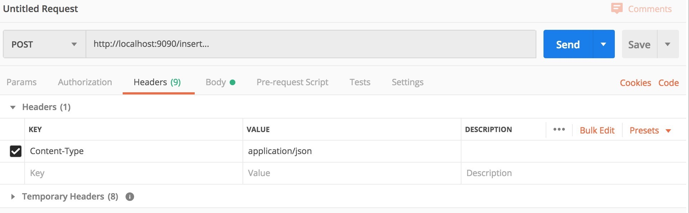
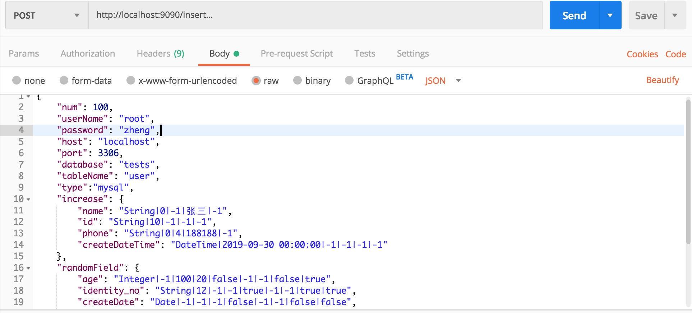

# common-insert

[[License]](./LICENSE)

一个可以按规则快速批量生成测试数据并导入数据源的工具  

支持插入的数据源  
文件：

- [x] csv文件
- [x] xls文件
- [x] xlsx文件

非关系型数据库：

- [x] elasticsearch
- [x] mongoDB

关系型数据库
- [x] mysql  

## 快速开始  
整个jar包是个springboot的web项目，启动后会在本地运行一个tomcat实例,端口默认为9090，完整的访问路径为http://localhost:9090/insert.目前并没有完成web页面，未来会更新加入web页面。因此暂时访问需要使用postman等web访问工具，选择post请求，请求头中Content-Type使用application/json，具体的使用方法下面会说明。   
1、确保本地有java8的运行时环境，然后可以直接将项目clone到本地，idea中启动  
2、你可以下载打好的jar包到本地，使用java -jar命令启动

如图：  
请求头:


请求体:  


### 请求示例
参数:  
首先贴出一个完整的请求参数再逐一进行解释。  
```json
{
    "num": 100,
    "userName": "root",
    "password": "root",
    "host": "localhost",
    "port": 3306,
    "database": "tests",
    "tableName": "user",
    "type":"mysql",
    "filePath": "",
    "increase": {
        "name": "String|0|-1|张三|-1",
        "id": "String|10|-1|-1|-1",
        "phone": "String|0|4|188188|-1",
        "createDateTime": "DateTime|2019-09-30 00:00:00|-1|-1|-1|-1"
    },
    "random": {
        "age": "Integer|-1|100|20|false|-1|-1|false|true",
        "identity_no": "String|12|-1|-1|true|-1|-1|true|true",
        "createDate": "Date|-1|-1|-1|false|-1|-1|false|false",
        "updateDate": "Date|-1|2019-09-30|2019-09-01|false|-1|-1|false|false",
        "updateDateTime": "DateTime|-1|2019-09-30 00:00:00|2019-09-01 00:00:00|false|-1|-1|false"
    },
    "constant": {
        "constant": "String|星宿老仙",
        "sex": "String|男,女"
    }
}
```
### 参数说明：  
num : 插入的条数，比如需要插入1000条数据这里就填1000  
userName : 如果数据源用户访问控制 ，这里填写用户名，如果不需要不用填  
password : 同上这里填写密码，如果不需要不用填  
host : 数据库的地址，如果是文件类型的数据源则不用填  
port : 数据库的端口，如果是文件类型的数据源则不用填，mysql默认是3306 mongo默认是27017 es默认是9200  
database : 数据库名，es中可以不用填  
tableName : 表名，mongo中称为collection，es中称为index  
type : 数据源的类型，目前支持 mysql、es、mongo、excel(csv,xls,xlsx)  
filePath : 如果使用的是excel的数据源,请填写文件所在路径，需要定义好表头数据  
increase : 需要自增的字段,本质是个Map或叫字典也行，以下类同。key是要插入的字段名，value是规则。规则: 类型|从几开始|位数|前缀|后缀  
random : 需要随机生成的字段，规则: 类型|长度|最大值|最小值|是否固定位数|前缀|后缀|是否唯一|是否是纯数字  
constant : 常量字段 规则：类型|值1,值2... 每条数据都会从值1或值2中随机选择一个

### 规则特殊说明
如无特殊说明，规则的每一位都要填不允许为空，只要是用是否开头描述的规则请填true或false。  
1、自增字段(类型|从几开始|位数|前缀|后缀) : 位数如果没有要求则填-1 否则请填写大于0的整数。程序会根据位数选择左补0或，删除多出来的位数，注意这个位数指不包含前后缀的位数。前缀后缀有就填，没有请填-1  
2、随机字段(类型|长度|最大值|最小值|是否固定位数|前缀|后缀|是否唯一|是否是纯数字) : 如果选择固定位数则长度必填，会根据长度左补0或截取，否则长度只是限制了最长的长度。最大值最小值以及前后缀有就填没有请填-1。是否唯一决定了随机出来的值是不是唯一的，如果是false则可能重复  
3、常量字段(类型|值1,值2...) : 其实就是枚举几种值，随机选一个  
4、如果是DateTime类型的数据，自增默认每次自增1秒 ，Date类型默认自增1天，暂时不能调整这个值 
5、如果自增字段没有填写从几开始，Date和DateTime类型默认从当前时间开始  
6、如果随机字段没有填写最大值最小值，Date和DateTime类型默认从当前时间为最小值 100天的后时间为最大值进行随机。  
7、如果随机字段唯一，注意随机字段的最大值和最小值范围必须大于插入的条数，否则会死循环。


### 字段类型
Integer  
String  
Long  
Double  
Date  
DateTime  
Decimal